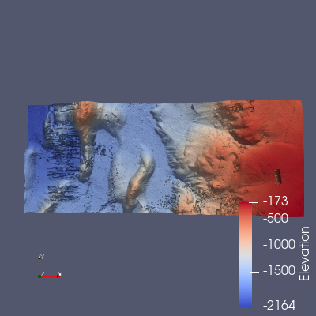

# NOAA to ParaView Converter

Convert NOAA bathymetric elevation exports (GeoTIFF) into 3D relief visualizations rendered with [ParaView](https://www.paraview.org/)'s Python API.

The script reads an elevation raster, masks out NODATA values, builds a `vtkImageData` grid from the elevation array, warps it into a 3D surface by elevation, and renders it colored by depth/height.



> [!NOTE]
> Area of interest on the screenshot: West -125.33030416613947, South 45.568749228801046, East -124.61069967395203, North 45.860247378725035

## Requirements

- Windows with [ParaView](https://www.paraview.org/download/) installed (developed against 5.13.2)
- Python 3.10 (must match the Python version bundled with your ParaView install)
- Python packages in [requirements.txt](requirements.txt): `numpy`, `tifffile`, `imagecodecs`

## Setup

1. Create a virtual environment:

   ```powershell
   py -3.10 -m venv pv-env
   ```

2. Activate it:

   ```powershell
   pv-env\Scripts\Activate.ps1
   ```

3. Install dependencies:

   ```powershell
   pip install -r requirements.txt
   ```

4. Point the scripts at your local ParaView install. Each script starts with:

   ```python
   sys.path.append(r"C:\Program Files\ParaView 5.13.2\bin\Lib\site-packages")
   os.add_dll_directory(r"C:\Program Files\ParaView 5.13.2\bin")
   ```

   Update these paths if ParaView is installed elsewhere or at a different version.

## Usage

- **`test1.py`** — minimal smoke test. Renders a cone in ParaView to confirm the venv can import `paraview.simple` and the DLL path is set up correctly.

  ```powershell
  python test1.py
  ```

- **`test2.py`** — the converter. Reads `data/exportImage.tiff`, cleans NODATA values, builds a VTK image grid from the elevation data, warps it into a 3D relief, colors it by elevation, and saves the render to `images/bathymetry.png`.

  ```powershell
  python test2.py
  ```

  Both scripts call `Interact()` at the end, which opens an interactive ParaView render window — close it (or press `q`) to end the script.

## Data

`data/exportImage.tiff` is expected to be a single-band elevation GeoTIFF exported from a NOAA bathymetry source (e.g. the [NOAA NCEI Bathymetric Data Viewer](https://www.ncei.noaa.gov/maps/bathymetry/)), with invalid/NODATA cells encoded as extreme sentinel values (`< -1e30` or `> 1e30`). Swap in your own export at that path, or edit the path in `test2.py`.

## Project structure

```
data/exportImage.tiff   NOAA elevation GeoTIFF input
images/bathymetry.png   Rendered output from test2.py
test1.py                ParaView smoke test
test2.py                TIFF -> VTK -> 3D relief converter
requirements.txt        Python dependencies
```
